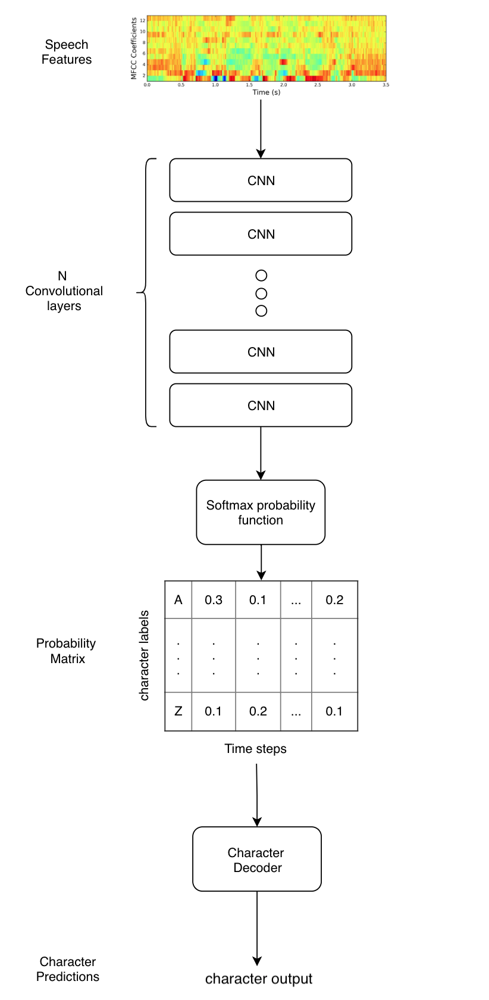

# Wav2Letter Speech Recognition with Pytorch

A Simple, straight forward, easy to read implementation of Wav2Letter, a speech recognition model from Facebooks AI Research (FAIR) [paper](https://arxiv.org/pdf/1609.03193.pdf). You can see most of the architecture in the `Wav2Letter` directory.

The next iteration of Wav2Letter can be found in this [paper](https://arxiv.org/abs/1712.09444). This paper uses Gated Convnets instead of normal Convnets.

The [Google Speech Command Example.ipynb](https://github.com/LearnedVector/Wav2Letter/blob/master/Google%20Speech%20Command%20Example.ipynb) notebook contains an example of this implementation.

<p align="center">
  
</p>

## Differences

* Uses CTC Loss
* Uses Greedy Decoder

## TODO

* Implement Train, Validation, Test sets
* Test on larger speech data
* Implement AutoSegCriterion
* Implement Beam Search Decoder
* Use KenLM Langauge Model in Decoder
* Use larger datasets
* Add Gated ConvNets

## Getting Started

## Requirements

```bash
pip install -r requirements.txt
```

Make sure you are using pytorch-nightly (version 1.0 alpha). This has the CTC_Loss loss function we need.

## Smoke Test

`smoke_test.py` contains a quick test to see if everything is working

```bash
python smoke_test.py
```

This will train a model on randomly generated inputs and target generated data. If everyhing is working correctly, expect to see outputs of the predicted and target labels. Of course expect the outputs to be garbage.

## Data

For an initial test, I used the [Google Speech Command Dataset](https://www.kaggle.com/c/tensorflow-speech-recognition-challenge/data). This is a simple to use lightweight dataset for testing model performance.

### Instructions to download data

1. Download the dataset.
2. Create a `./speech_data` directory at root of this project.
3. Unzip the google speech data. Should be named `speech_commands_v0.01`.

### Prepare data

`data.py` contains scripts to process google speech command audio data into features compatible with Wav2Letter.

```bash
python Wav2Letter/data.py
```

This will process the google speech commands audio data into 13 mfcc features with a max framelength of 250 (these are short audio clips). Anything less will be padded with zeros. Target data will be integer encoded and also padded to have the same length. Final outputs are numpy arrays saved as `x.npy` and `y.npy` in the `./speech_data` directory.

## Train

`train.py` has the code to run the training. Example would be.

```bash
python train.py --batch_size=256 --epochs=1000
```

## Contributions

Pull Requests are accepted! I would love some help to knock out the Todo's. Email me at learnedvector@gmail.com for any questions.
